# Table of Content

## Preparation 
- You will be provided with an azure account id and credentials to login.
  
## Create your own chatbot

- Open the Azure Language cognitive services page https://language.cognitive.azure.com/home 

- Select "Custom Question Answering"

- Click on "Create new project"

- Click on "Add Source" --> "URL's"

- Add a URL (Ex: https://www.ubs.com/global/en/investor-relations/contact/faq.html) and give it an "URL Name" (Ex: UBS FAQ). Click on "Add All"

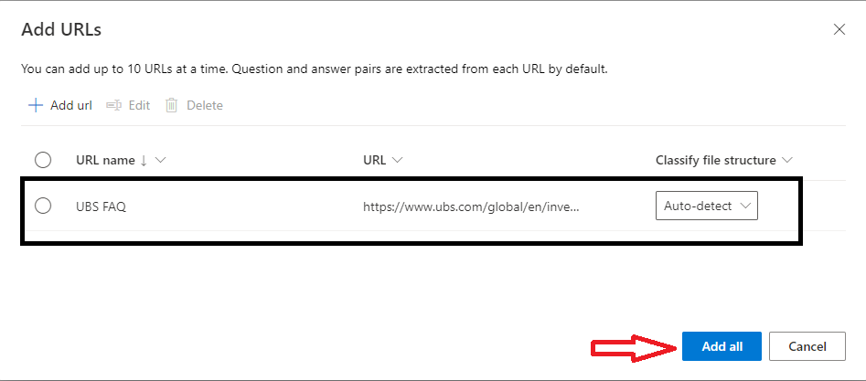

- The questions and answer from the url will be ingested and a knowledge base will be created as shown below. Once the Knowledge base is created, you can click on "Edit Knowledge base" see the questions and answers.

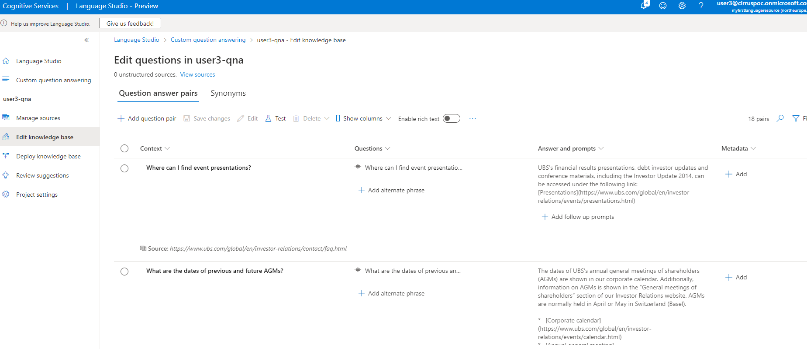

- Click on "Deploy Knoweldge base" in the left menu pane and then click on "Deploy" button.
 
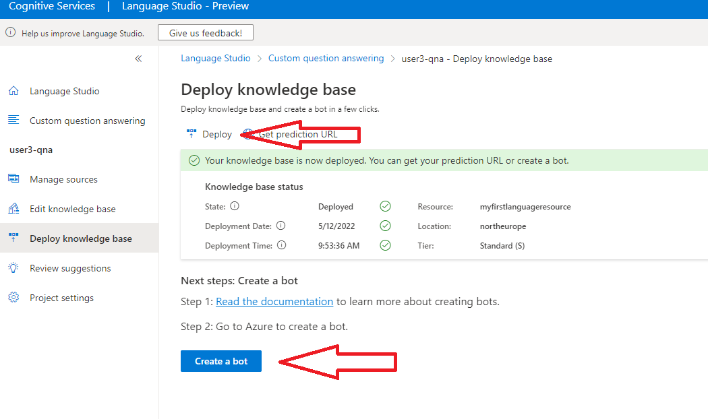

Once the deploy completes, you can can then click on "Create a bot" option presetend. 

- This will take you to the portal.azure.com as shown below.
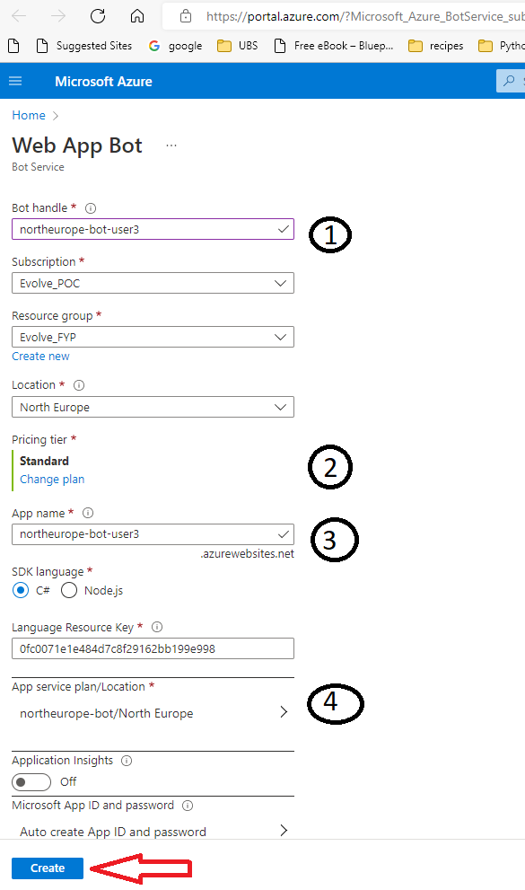

 Append your username to the "Bot handle". Ex: user3 in screenshot above. Refer 1 in image above

 Change the "Pricing Tier" to "Free". Refer 2 in image above.

 "App name" usualy matches the "Bot Handle". If not, update it to make it unique. Refer 3 in image above.

 "App service plan/location" should be populated by default. If not, raise it to the presenter. Refer 4 in image above.

 Click on "Create". Wait for the resource to be created.

- Click on "Goto Resource"
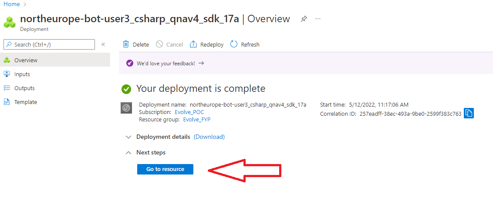

- Click on "Test in web chat". Wait for hte welcome message to appear. ex: "Hello and Welcome". You can now ask questions and interact with this bot.

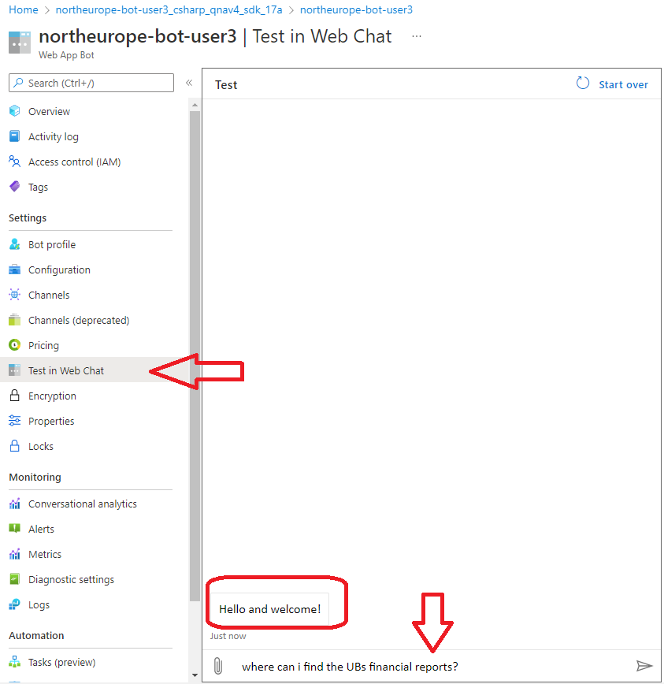

- Enable "Microsoft Teams" under "Channels" . Read and Agree the terms and conditions. Select "Commercial" and click on "Apply".

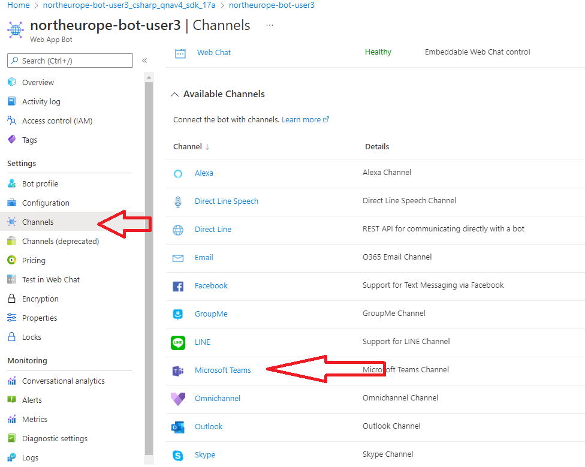

Click on "Close"

- Click on "Get bot Embed codes" or clikc on "Open in Teams"

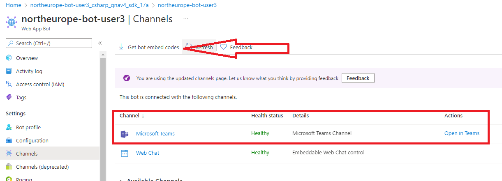

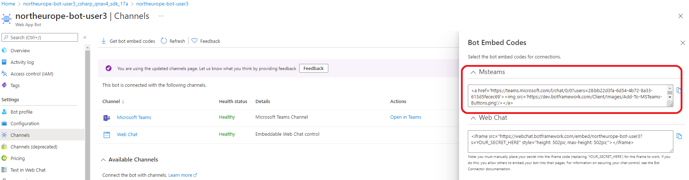

- You need to enter the credentials passed on to you when prompted. Open in web and not the desktop Teams app. You may get error's as shown below for the first time login. Be patient and wait for about 5-10 mins. 

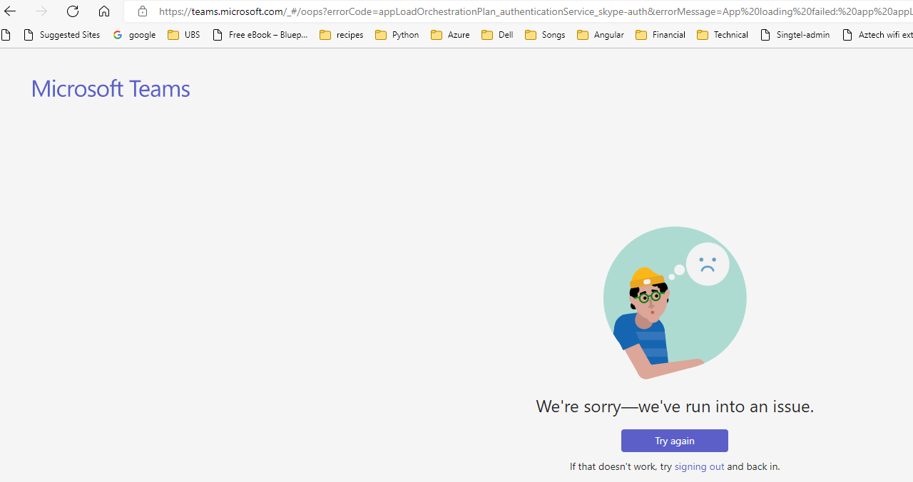

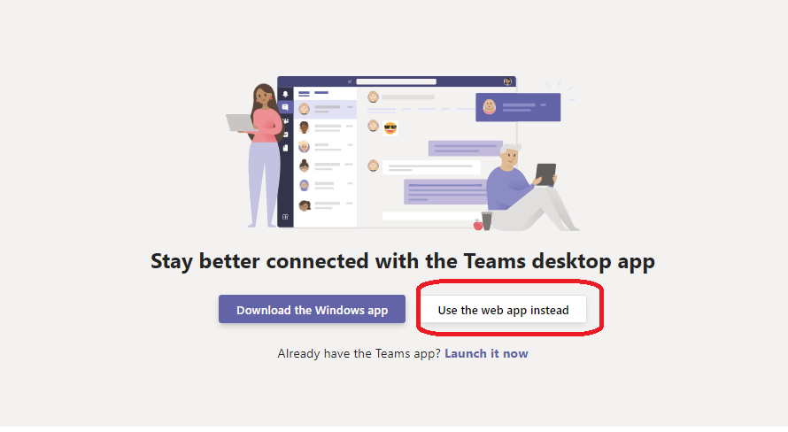

- You should now see the Chatbot avaialble for you to interact. 

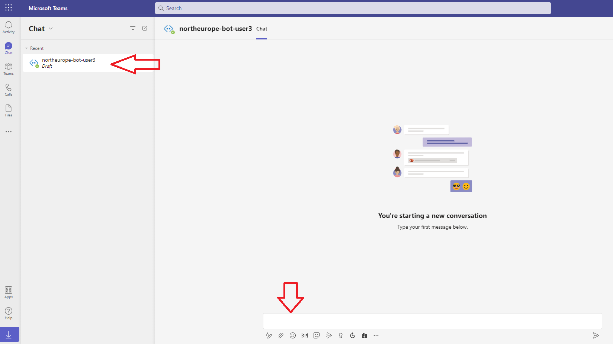
